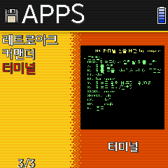

# rgnano_binary

Sponsorship is always welcome.
[https://ko-fi.com/trngaje](https://ko-fi.com/trngaje)

> installer : FunKey Add on

You can download it from the following path.

[https://github.com/trngaje/rgnano_binary/releases/download/trngaje_230726/funkeyaddon_230728_4.opk](https://github.com/trngaje/rgnano_binary/releases/download/trngaje_230726/funkeyaddon_230728_4.opk)

Distribution is free, but please do not share files directly.
Only link shares that contain this description page are allowed.
It also does not allow sharing by repackaging individual files.

include advmenu, advmame, retroarch, runcommand, cores

> installer : simplemenu for both Funkery and anbernic

korean and english version :

[https://github.com/trngaje/rgnano_binary/releases/download/trngaje_230726/install_simplemenu-rgnano.opk](https://github.com/trngaje/rgnano_binary/releases/download/trngaje_230726/install_simplemenu-rgnano.opk)

## new feature

### advmenu (frontend)

> 2x2 title

> runcommand

> extra command in /mng/FunKey/.advance/advmenu.rc(this is not official)

    ui_runcommand_cfg /mnt/runcommand
    misc_languagefile hangulmenu.lng
    #ui_ip ifconfig wlan0 | grep 'inet addr' | cut -d: -f2 | awk '{print $1}' | tr -d '\n'
    #ui_battery cd /customer/app/ ; ./axp_test |  awk 'match($0, /"battery"/){print substr($0, 12, 3)}' | sed 's/,//'
    event_assign runcommand lshift
    event_assign cancel b

to display korean to english (comment below)
    /mng/FunKey/.advance/advmenu.rc

    #misc_languagefile hangulmenu.lng    

    ui_command_menu runcommand

>key assign

sel : display menu
Power : quit
A : select
start : flag for select item (ex. in emulator include)
B : cancel
l : page up
r : page down

### advmame

> autofire

> extra command in   /mng/FunKey/.advance/advmame.rc

to display korean to english (comment below)

    #misc_lang korea
    #misc_languagefile hangul.lng

>key assign

    L+R : display menu
    L+B : pause
    B : button 1
    A : button 2
    X : button 3
    Y : button 4
    Power : display exit menu

### advmess

[how to run advmess](advmess.md)

### simple terminal

support korean font to display

to run a command script (need full path)
(hide welcome help with command script)

    st -e <command>

### retroarch

korean font : 11x11 instead of 10x10 official retroarch

I will also share the official version of 10x10 font.

### sdlretro

sdlretro not support .zip (compressed rom)

### simplemenu

[video:change language](https://youtube.com/shorts/Y1V22Wa9O7c?si=tRuW8Gx07sRON6NG)

[video:launch other frontend by funkey menu](https://youtu.be/H-uzrnraYII?si=ZU_f5Jxcq8HBgA10)

add 240x240 theme

240x240/0a

240x240/bigcody

240x240/comics

help screen for korean version

emulator selector for 240x240

### dingux-msx standalone emulator

[https://github.com/trngaje/rgnano_binary/releases/download/trngaje_230726/dingux-msx-rgnano_230806_1.opk](https://github.com/trngaje/rgnano_binary/releases/download/trngaje_230726/dingux-msx-rgnano_230806_1.opk)

korean menu

    /usr/games/
    ├── advmame
    ├── advmenu
    ├── advmess
    ├── invoker
    ├── resources
    │   └── akashi.ttf
    └── simplemenu

    /mnt/Anbernic or FunKey/
    ├── .advance
    │   ├── Galmuri11.ttf
    │   ├── advmame.rc
    │   ├── advmenu.rc
    │   ├── advmess.rc
    │   ├── hangul.lng
    │   ├── hangulmenu.lng
    ├── .config
    │   └── retroarch
    │       ├── retroarch.cfg
    ├── .dingux-msx
    │   ├── kbd
    │   │   ├── Antarctic Adventure (Japan).kbd
    │   │   └── Legendly Knight (1988)(Topia).kbd
    │   ├── roms
    │   ├── save
    │   │   ├── sav_Bubble Bobble (Japan)_0.sta
    │   │   ├── sav_Moai no Hibou (Japan)_0.sta
    │   │   └── sav_carta_0.sta
    │   ├── scr
    │   ├── set
    │   │   └── Antarctic Adventure (Japan).set
    │   └── txt
    ├── .picoarch
    │   └── system
    │       ├── 32X_G_BIOS.BIN
    │       ├── 32X_M_BIOS.BIN
    │       ├── 32X_S_BIOS.BIN
    │       ├── syscard3.pce
    │       └── us_scd1_9210.bin
    ├── .picodrive
    │   ├── cfg
    │   ├── config2.cfg
    │   └── srm
    ├── .sdlretro
    │   ├── cfg
    │   │   ├── cores
    │   │   └── sdlretro.json
    │   ├── system
    │   │   ├── 32X_G_BIOS.BIN
    │   │   ├── 32X_M_BIOS.BIN
    │   │   ├── 32X_S_BIOS.BIN
    │   │   └── us_scd1_9210.bin
    │   └── tmp
    ├── .simplemenu
    │   ├── alias.txt
    │   ├── apps
    │   │   ├── DinguxCommander.fgl
    │   │   ├── ejectusb.fgl
    │   │   ├── mountusb.fgl
    │   │   ├── retroarch.fgl
    │   │   ├── snap
    │   │   └── st_kor-anbernic_230803.opk
    │   ├── arcade.txt
    │   ├── config.ini
    │   ├── english.lang
    │   ├── games
    │   │   └── snap
    │   ├── kor.lang
    │   ├── last_state.sav
    │   ├── section_groups
    │   │   ├── apps_games.ini
    │   │   ├── arcades.ini
    │   │   ├── consoles.ini
    │   │   ├── handhelds.ini
    │   │   └── home PC.ini
    │   ├── themes
    │   │   └── 240x240
    │   └── wonderswancolor.txt
    ├── lan
    ├── poweroff_time
    ├── snapshots
    └── temp

    /mnt/Applications/
    ├── advmenu-anbernic_230814_1.opk
    ├── backup_all-anbernic.opk
    ├── retroarch-anbernic_230803.opk
    ├── retroarchorg-anbernic_230803.opk
    ├── simplemenu-rgnano.opk
    ├── sm64_v1.1_anbernic.opk
    └── st_kor-anbernic_230803.opk

    /mnt/Emulators/
    ├── advmame-anbernic_230804.opk
    ├── dingux-msx-anbernic_230805_9.opk
    ├── st4sh-rgnano.opk

    /mnt/bin/
    ├── cores
    │   ├── bluemsx_libretro.so
    │   ├── bsnes_libretro.so
    │   ├── cannonball_libretro.so
    │   ├── desmume2015_libretro.so
    │   ├── dosbox_pure_libretro.so
    │   ├── easyrpg_libretro.so
    │   ├── fake08_libretro.so
    │   ├── fbalpha2012_cps1_libretro.so
    │   ├── fbalpha2012_cps2_libretro.so
    │   ├── fbalpha2012_cps3_libretro.so
    │   ├── fbalpha2012_libretro.so
    │   ├── fbalpha2012_neogeo_libretro.so
    │   ├── fbneo_libretro.so
    │   ├── fceumm_libretro.so
    │   ├── fmsx_libretro.so
    │   ├── freej2me_libretro.so
    │   ├── gambatte_libretro.so
    │   ├── gearboy_libretro.so
    │   ├── genesis_plus_gx_libretro.so
    │   ├── genesis_plus_gx_wide_libretro.so
    │   ├── gpsp_libretro.so
    │   ├── gw_libretro.so
    │   ├── mame0139_libretro.so
    │   ├── mame078plus_libretro.so
    │   ├── mame2003_libretro.so
    │   ├── mame2003_plus_kaze_libretro.so
    │   ├── mame2003_plus_libretro.so
    │   ├── mame2003_xtreme_libretro.so
    │   ├── mame2010_libretro.so
    │   ├── mednafen_lynx_libretro.so
    │   ├── mednafen_ngp_libretro.so
    │   ├── mednafen_pce_fast_libretro.so
    │   ├── mednafen_saturn_libretro.so
    │   ├── mednafen_vb_libretro.so
    │   ├── mednafen_wswan_libretro.so
    │   ├── mesen_libretro.so
    │   ├── mgba_libretro.so
    │   ├── neocd_libretro.so
    │   ├── nestopia_libretro.so
    │   ├── np2kai_libretro.so
    │   ├── pcsx_rearmed_libretro.so
    │   ├── picodrive_libretro.so
    │   ├── pokemini_libretro.so
    │   ├── prboom_libretro.so
    │   ├── prosystem_libretro.so
    │   ├── quicknes_libretro.so
    │   ├── sameboy_libretro.so
    │   ├── snes9x2005_plus_libretro.so
    │   ├── snes9x2010_libretro.so
    │   ├── snes9x2018_libretro.so
    │   ├── snes9x_libretro.so
    │   ├── squirreljme_libretro.so
    │   ├── stella2014_libretro.so
    │   ├── tic80_libretro.so
    │   ├── vba_next_libretro.so
    │   ├── vice_x64_libretro.so
    │   ├── virtualjaguar_libretro.so
    │   └── yabasanshiro_libretro.so
    ├── pc98.sh
    ├── picoarch
    ├── picoarch.sh
    ├── retroarch
    ├── sdlretro
    └── sdlretro.sh

    /mnt/runcommand/
    ├── cfg
    │   ├── 3do.cfg
    │   ├── apple2.cfg
    │   ├── arcade.cfg
    │   ├── atarijaguar.cfg
    │   ├── atomiswave.cfg
    │   ├── c64.cfg
    │   ├── dreamcast.cfg
    │   ├── easyrpg.cfg
    │   ├── fbn.cfg
    │   ├── fbneo.cfg
    │   ├── fds.cfg
    │   ├── gameandwatch.cfg
    │   ├── gamecube.cfg
    │   ├── gamegear.cfg
    │   ├── gb.cfg
    │   ├── gb_sgb.sh
    │   ├── gba.cfg
    │   ├── gbc.cfg
    │   ├── hbmame.cfg
    │   ├── lynx.cfg
    │   ├── macintosh.cfg
    │   ├── mame-advmame.cfg
    │   ├── mame-mame4all.cfg
    │   ├── mame.cfg
    │   ├── mame2010.cfg
    │   ├── mastersystem.cfg
    │   ├── megadrive.cfg
    │   ├── msx.cfg
    │   ├── msx2.cfg
    │   ├── n64.cfg
    │   ├── n64.sh
    │   ├── naomi.cfg
    │   ├── nds.cfg
    │   ├── neogeo.cfg
    │   ├── neogeocd.cfg
    │   ├── nes.cfg
    │   ├── ngp.cfg
    │   ├── ngpc.cfg
    │   ├── openbor.cfg
    │   ├── openbor.sh
    │   ├── pc.cfg
    │   ├── pc88.cfg
    │   ├── pc98.cfg
    │   ├── pc98.sh
    │   ├── pcengine.cfg
    │   ├── pcenginecd.cfg
    │   ├── pcfx.cfg
    │   ├── pico8.cfg
    │   ├── pokemini.cfg
    │   ├── psp.cfg
    │   ├── psx.cfg
    │   ├── saturn.cfg
    │   ├── scummvm.cfg
    │   ├── scummvm.sh
    │   ├── sega32x.cfg
    │   ├── segacd.cfg
    │   ├── snes.cfg
    │   ├── tic8.cfg
    │   ├── virtualboy.cfg
    │   ├── wonderswan.cfg
    │   └── wonderswancolor.cfg
    ├── runcommand.cfg
    ├── runcommand.sh
    ├── runcommand_end.sh
    ├── runcommand_setting.sh
    ├── runcommand_start.sh

rom path in advmenu.rc

    /mnt/mame-advmame/ (MAME 0.106 romsets)
    /mnt/mame2003/
    /mnt/mame2010/
    /mnt/fbneo/
    /mnt/Game Boy Advance/
    /mnt/NES/
    /mnt/SNES/
    /mnt/Game Boy/
    /mnt/Game Boy Color/
    /mnt/PCE-TurboGrafx/
    /mnt/megadrive/
    /mnt/msx/
    /mnt/pc/
    /mnt/pc98/
    /mnt/gameandwatch/
    /mnt/nds/
    /mnt/advmess/ (bios for advmess)

sub path

    snap/     - for snap images for rom (.png)
    mng/      - for mng,mp3 files for rom

prebuilt cores lists by myself

    mame2003_plus_libretro.so (korean menu)
    mame2010_libretro.so
    dosbox_pure_libretro.so
    snes9x_libretro.so
    gw_libretro.so
    fmsx_libretro.so
    bluemsx_libretro.so
    mgba_libretro.so
    np2kai_libretro.so
    fake08_libretro.so
    tic80_libretro.so
    mednafen_supafaust_libretro.so

defined key value

basic keys

key value | function
--------- | --------
KEY_L | dpad left
KEY_R | dpad right
KEY_U | dpad up
KEY_D | dpad down
KEY_A | button A
KEY_B | button B
KEY_X | button X
KEY_Y | button Y
KEY_K | select
KEY_S | start
KEY_M | L
KEY_N | R
KEY_Q | quit

multi keys| key value
----------| --------
select + left | KEY_J
select + right | KEY_I
select + down | KEY_H
select + L | KEY_V
select + R | KEY_O
select+UP  |  nap
select+A   |  volume_up
select+Y   |  volume_down
select+X   |  bright_up
select+B   |  bright_down
select+L+R |  display_notif_system_stats

### license and reference

galmuri 11x11 font is included for advmame/advmenu

[https://github.com/quiple/galmuri/tree/main/dist](https://github.com/quiple/galmuri/tree/main/dist)

mng and mp3 files can be found for advmenu

[https://www.advancemame.it/download](https://www.advancemame.it/download)
